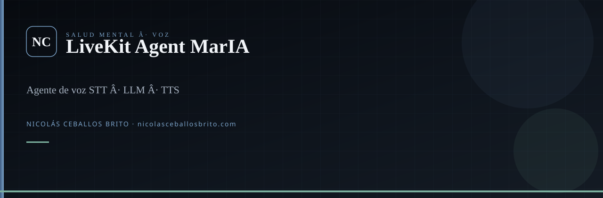
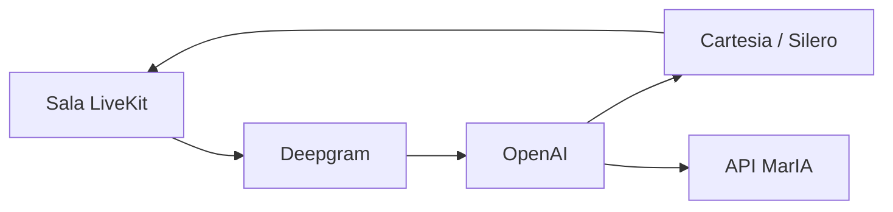

<div align="center">
  
</div>

<br />

<div align="center">

**Agente de voz de MarIA.** Este repo no es el sitio: es el proceso Python que escucha, piensa y habla.

[](https://www.python.org/)
[](https://livekit.io/)

Frontend y API: [MarIA](https://github.com/Nico2603/MarIA).

</div>

## Qué es

`MariaVoiceAgent` corre el pipeline **STT → LLM → TTS** dentro de una sala LiveKit. Enriquecce la UI (tarjetas, links, QR al cerrar) y sincroniza la sesión con el backend de MarIA (`BASE_API_URL`).

## Qué hace el código

- Prompt centrado en ansiedad / acompañamiento (no diagnóstico)
- TTS adaptativo (varios proveedores)
- Timeout de sesión ~30 min y cuotas por usuario
- Respuestas enriquecidas: botones, YouTube, QR de cierre
- Reintentos HTTP hacia la API de MarIA



## Arranque

```bash
git clone https://github.com/Nico2603/LiveKit_Agent_MarIA.git
cd LiveKit_Agent_MarIA
python -m venv .venv
.venv\Scripts\activate
pip install -r requirements.txt
```

Configura LiveKit, OpenAI, Deepgram y `BASE_API_URL` apuntando a MarIA. Arranca MarIA primero.

## Familia

[ChatBot-MentalHealth-BERT](https://github.com/Nico2603/ChatBot-MentalHealth-BERT) · [MarIA](https://github.com/Nico2603/MarIA) · **este agente**

## Agentes

`.agents/skills/` — Superpowers, `nicolas-identity`, `find-skills`. `graphify update .`

---

<div align="center">

**Nicolás Ceballos Brito** · Ingeniero en Sistemas y Telecomunicaciones (UCP 2025)  
CTO · Prosavis · Pereira, Colombia

[nicolasceballosbrito.com](https://nicolasceballosbrito.com)
·
[GitHub](https://github.com/Nico2603)
·
[LinkedIn](https://www.linkedin.com/in/nicolas-ceballos-brito/)
·
[X](https://x.com/NicolasCBrito)
·
[Instagram](https://www.instagram.com/nico_ceballos26/)
·
[Hugging Face](https://huggingface.co/Flackoooo)
·
[Email](mailto:nicolasceballosbrito@gmail.com)

</div>
